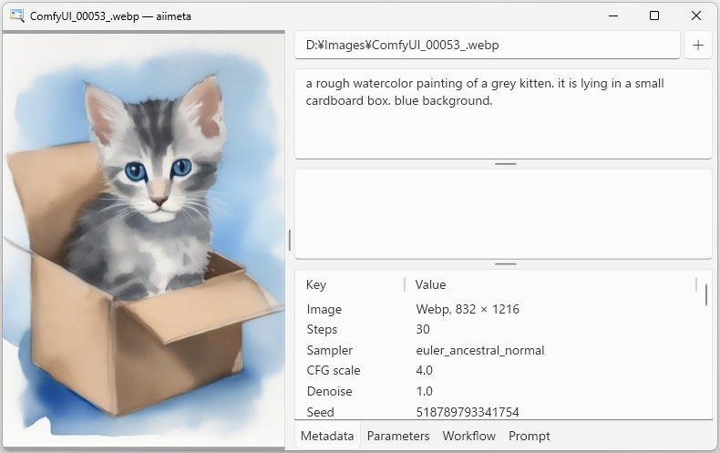

# aiimeta - AI Image Metadata Viewer for Windows

aiimeta is a small Windows app to show metadata of AI-generated images,
including prompt texts, used models, and other parameters such as noise seed or CFG scale.

If you are a user of [Stable Diffusion WebUI](https://github.com/AUTOMATIC1111/stable-diffusion-webui)
(often called "A1111"),
you may know its "PNG Info" function.
aiimeta works like it.

## Environment and Prerequisites

aiimeta is a .NET 10 WPF app running on Windows 11 computers.
Other operating systems are not supported.

You will need to install the .NET Desktop Runtime on your PC to run the aiimeta app.
See below for how to install it.

aiimeta doesn't use Python.
You don't need Python on you PC to run aiimeta.

## Usage

### Installing and Running

1. Download a binary ZIP file from the _Releases_ page.
2. Create a new empty folder at your convenient location in your PC.
3. Unzip the downloaded file and copy all the content files to the new folder.
4. Double click the `aiimeta.exe` on your File Explorer.

### Installing .NET Desktop Runtime

You need .NET Desktop Runtime installed on your PC to run aiimeta.

You can download it from the Microsoft website:
https://dotnet.microsoft.com/en-us/download/dotnet/10.0.
Choose and download the installer for ".NET Desktop Runtime" available on the page,
then run the downloaded installer.

Alternatively, you can just install the aiimeta app and try to run it.
If you have already installed the required runtime, the app just starts.
If not, Windows suggests you to download and install the required .NET Desktop Runtime.
You can simply click OK several times to download the required installer.
(You still need to run the downloaded installer manually by yourself.)

### Viewing Metadata

Just drag and drop an image on the _image area_ of the app window (the left half).
You can drag a local file on your PC from File Explorer.
You can also drag a web image from some Web browsers such as Internet Explorer or Google Chrome.
(Some websites technically prohibit dragging an image from their sites, though.)

You can also click on the "+" button on the top-right corner to open a dialog box for an image file.

aiimeta provides handy ways to copy metadata _values_ to the clipboard, too,
so that you can paste them on your generation tools.

## Functionality

### AI Tools and Services

aiimeta can currently handle metadata generated by the following tools and services:

* [Stable Diffusion WebUI](https://github.com/AUTOMATIC1111/stable-diffusion-webui) (often called "A1111"),
* [ComfyUI](https://github.com/Comfy-Org/ComfyUI) and [Comfy Cloud](https://www.comfy.org/cloud),
* [SwarmUI](https://github.com/mcmonkeyprojects/SwarmUI), and
* [Civitai](https://civitai.com/) on-site generator.

Also, as A1111 is a kind of a de facto standard,
other tools and services may produce A1111-compatible metadata,
which aiimeta can handle.

Note, however, not all images generated by above tools and services carry their metadata in them.

### Image File Formats

aiimeta can handle the following image file formats.

* PNG
* JPEG
* WebP

I believe these three formats are all that _any_ AI image generation tools and services produce,
and they should be enough.
As long as, of course, talking about still images.
aiimeta doesn't support any video files for the moment.

## Limitations and Notes

### Preview image quality

The image shown on the left of the main window is only for a preview,
which often appears in a lower quality than the original.
(It is to improve the app's internal processing performance.)

### Error messages

aiimeta currently makes no effort to show a descriptive error message.
When it faces an error, such as "File not found",
it simply dumps its internal information on the error
(called _exception_ in programmers' terminology),
which is often not useful for typical users.

### Non-normalization

Terminology in generative AI technologies is a mess.
A same thing may be called with varieties of words,
and a same term may be used for completely different things.
Just for an example,
one tool may use three terms "model", "checkpoint", and "weights" interchangeably,
while another tool may uses all the three terms to refer to three different things.

aiimeta doesn't try to solve the confusion.
It just uses the word used in the metadata it is showing,
and never tries to _normalize_ the terms.

## Legalies, Credits, and Acknowledgements

### Acknowledgement

This app is inspired and heavily influenced by
[Stable-Diffusion Prompt Reader](https://github.com/receyuki/stable-diffusion-prompt-reader) by Rhys Yang.
The author of this app, Alissa Sabre, appreciates Yang for their remarkable work.

### License

aiimeta is distributed under the MIT License.

### Dependencies

aiimeta uses the following third party libraries, and its binary ZIP contains their binaries.
They are not covered by aiimeta's own license terms.

* [Json.NET](https://www.newtonsoft.com/json) (aka Newtonsoft.Json) by Newtonsoft, [MIT License](https://github.com/JamesNK/Newtonsoft.Json/blob/master/LICENSE.md)
* [ImageSharp](https://sixlabors.com/products/imagesharp/) by SixLabors, [Six Labors Split License](https://github.com/SixLabors/ImageSharp/blob/main/LICENSE)
  with Apache License option for the purpose of distribution of aiimeta binaries by Alissa Sabre.

### App icon

The application icon,
[Everaldo-Crystal-Clear-App-picture-view.ico](aiimeta/UI/Everaldo-Crystal-Clear-App-picture-view.ico),
is designed by [Everaldo Coelho](https://en.wikipedia.org/wiki/Everaldo_Coelho),
distributed under the [LGPL 2.1](https://www.gnu.org/licenses/lgpl-2.1.html) license,
and downloaded from [IconArchive.com](https://www.iconarchive.com/show/crystal-clear-icons-by-everaldo/App-picture-view-icon.html).

It was originally a part of [Crystal Clear](https://commons.wikimedia.org/wiki/Crystal_Clear) icon set,
distributed with the following text:

> The Crystal Clear icon set was created by
> Everaldo Coelho, http://www.everaldo.com/
>
> All Icons are free software; you can redistribute it and/or modify it under the terms of the GNU Lesser General Public License as published by the Free Software Foundation; either version 2.1 of the License, or (at your option) any later version. This library is distributed in the hope that it will be useful, but without any warranty; without even the implied warranty of merchantability or fitness for a particular purpose.
>
> License details:
> Visit http://www.everaldo.com/crystal/?action=license for details.

### Disclaimer

THE SOFTWARE IS PROVIDED "AS IS", WITHOUT WARRANTY OF ANY KIND, EXPRESS OR IMPLIED, INCLUDING BUT NOT LIMITED TO THE WARRANTIES OF MERCHANTABILITY, FITNESS FOR A PARTICULAR PURPOSE AND NONINFRINGEMENT.
IN NO EVENT SHALL THE AUTHORS OR COPYRIGHT HOLDERS BE LIABLE FOR ANY CLAIM, DAMAGES OR OTHER LIABILITY, WHETHER IN AN ACTION OF CONTRACT, TORT OR OTHERWISE, ARISING FROM, OUT OF OR IN CONNECTION WITH THE SOFTWARE OR THE USE OR OTHER DEALINGS IN THE SOFTWARE.

### Copyright

aiimeta is written and distributed by Alissa Sabre.
